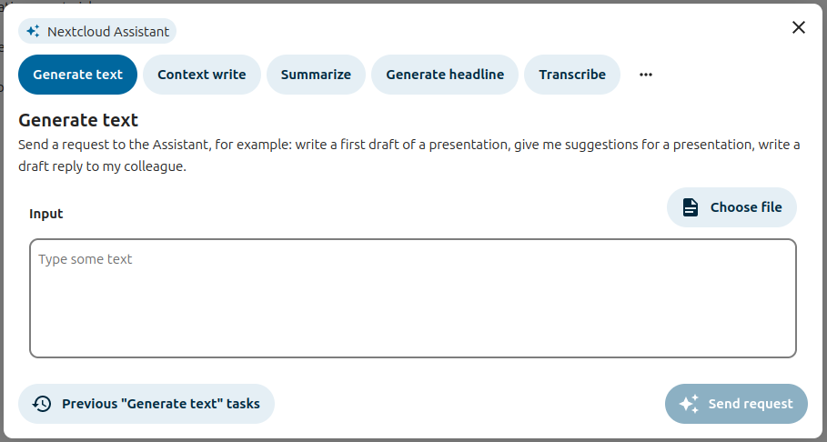
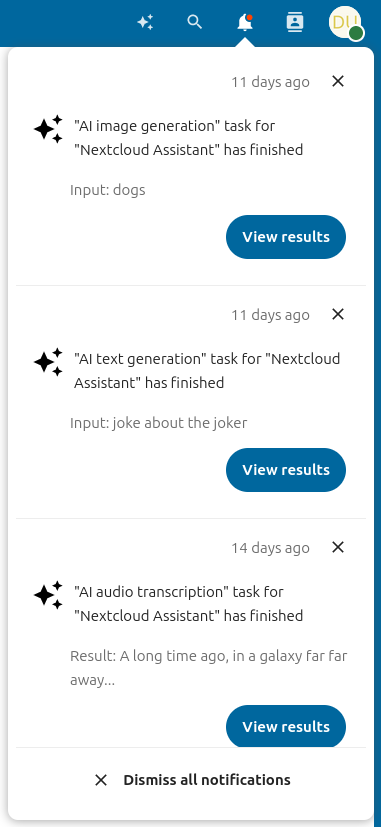
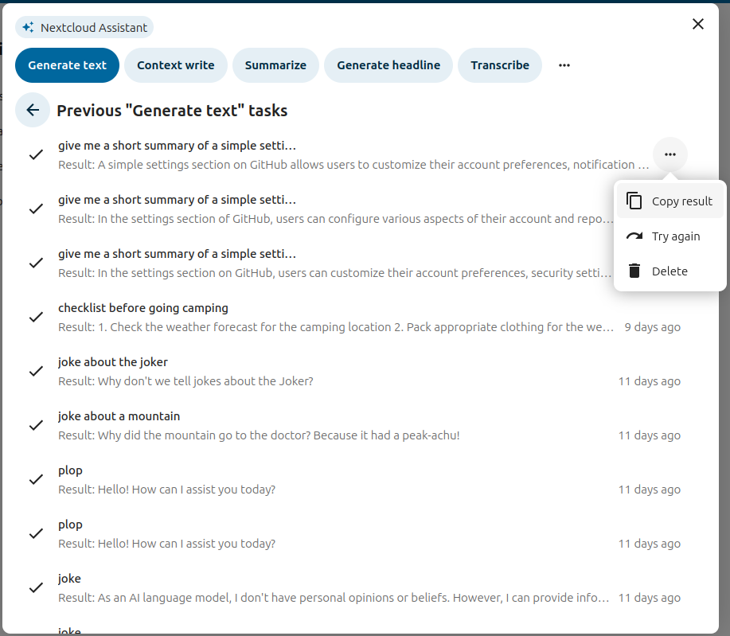
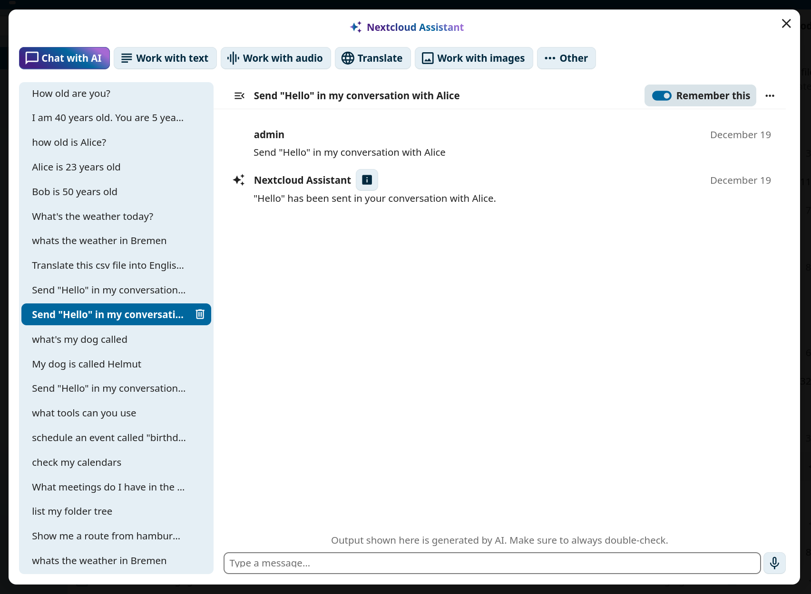
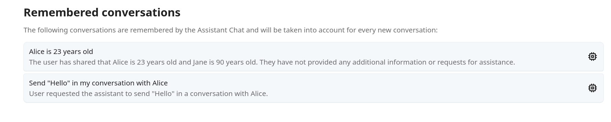
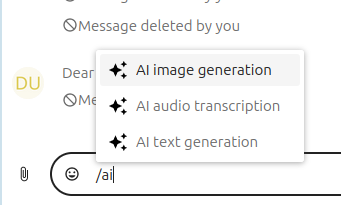
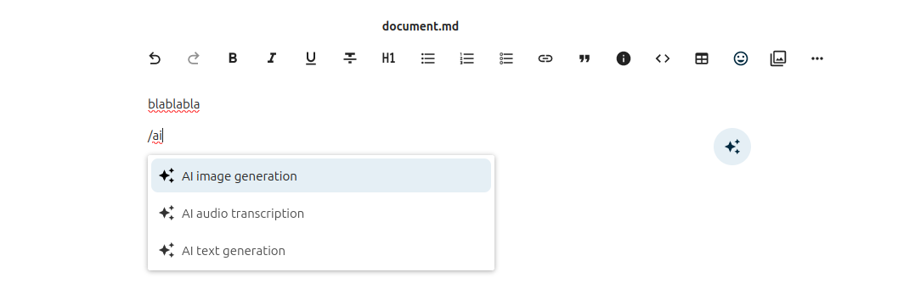

<!--
  - SPDX-FileCopyrightText: 2024 Nextcloud GmbH and Nextcloud contributors
  - SPDX-License-Identifier: AGPL-3.0-or-later
-->
# User documentation

## Personal settings

The Assistant personal settings can be found under the "Artificial intelligence" section.
You can disable the assistant top menu entry there. You can also disable the AI-related smart pickers.

## Assistant

### Run a task

To run a task with the Assistant, just open it via the top menu entry (on the top right).

Then choose a task type at the top of the assistant.
Then fill up the input form and press the submit button at the bottom right.

You task will run immediately if possible or be scheduled for later execution.

### Notifications

If the task was scheduled, you can request to receive a notification when it has finished.
You can display the task results by clicking the "View results" button in the notification.

### History

On the left side of the assistant, there is a task history list.
This task history is filtered to only show tasks of the currently selected task type.
You can then relaunch previous tasks, delete them or just cancel them if they were scheduled.

### Chat with AI

In the *Chat with AI* tab of the Assistant, you can have a back-and-forth conversation with the connected AI. Just type a message into the bottom text field, hit enter and you will get a response. 
You can have different conversations, click on *New conversation* to open a new one.

Every conversation has its own context, but you can use the "Remember this" toggle to add a conversation to the long-term memory of the AI. The context of remembered conversations is then available in any other conversation. To reverse this and delete a conversation from memory, turn the toggle off again.

In the Assistant page of your Personal settings, you can find a list of all your remembered conversations.

## Smart picker

The assistant app provides 3 smart pickers that you can access in Talk,
Text and in every place where rich text edition is possible.
To use them, type "/" and then "ai". They will appear in the filtered provider list.

In Talk:

In Text:

This will open the known Assistant view, and any generated result can be directly inserted in the current context.
